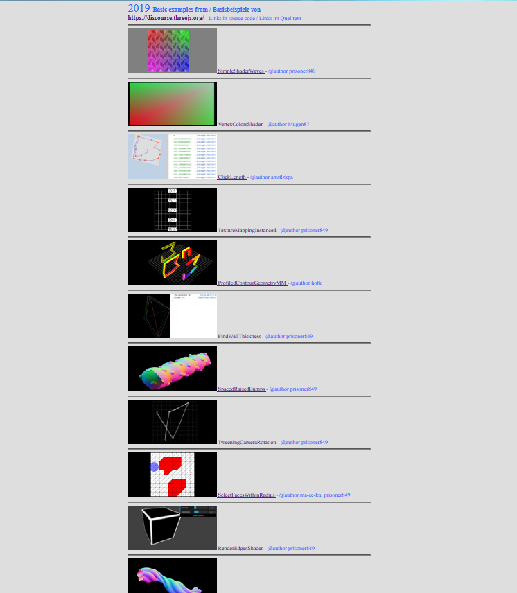

## main page ##

*under construction*

---

### three.js ###

own examples    | discourse example collection 
--------------- | ---------------------------- 
[threejs.hofk.de](https://threejs.hofk.de) | [* discourse.threejs.hofk.de](https://discourse.threejs.hofk.de)
 . | see [discourse.threejs.org](https://discourse.threejs.org/t/collection-of-examples-from-discourse-threejs-org/4315)
 | 

---

### Simulation HC680 Processor ###

see https://cpusimulation.hofk.de/

 . | CPU Simulation 8 bit  ( Windows )  |  Program - Sourcecode          |   
---|-------------------|---------------------------------------------------------------- |
 |  | https://github.com/hofk/hofk.github.io/tree/master/resourcesDE  |  
 |  | https://github.com/hofk/hofk.github.io/tree/master/resourcesEN  |

